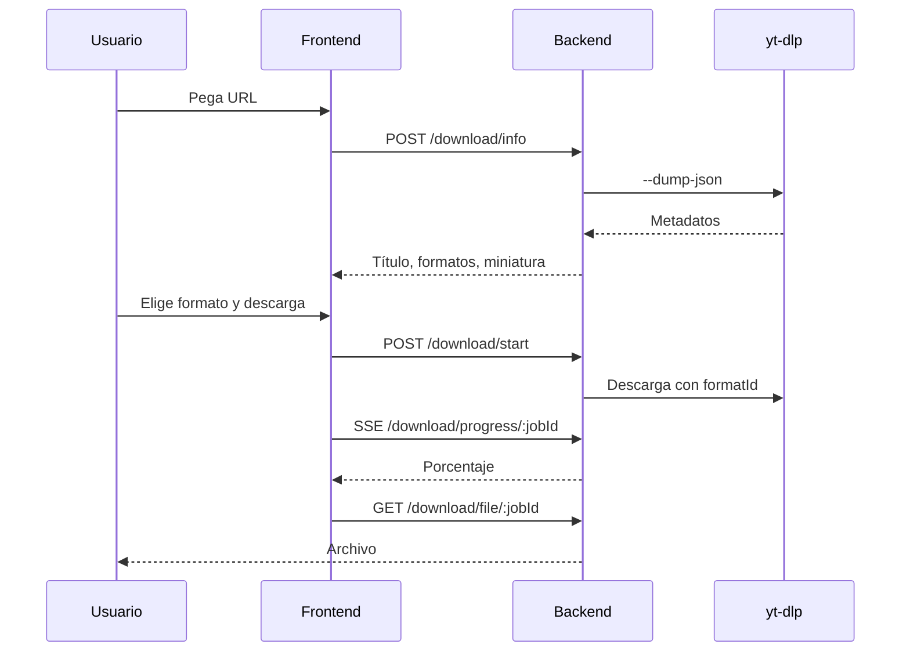

# Video Downloader

Aplicación full stack para descargar videos desde URLs compatibles con [yt-dlp](https://github.com/yt-dlp/yt-dlp). Incluye una interfaz React moderna (**JownloaderGlobal**) y una API NestJS que gestiona metadatos, descargas en segundo plano y progreso en tiempo real vía SSE.

## Características

- Vista previa del video (título, miniatura, duración, plataforma)
- Selector de formatos (video, audio, MP3)
- Barra de progreso en tiempo real durante la descarga
- Tema claro / oscuro
- Rate limiting en la API (Throttler)
- Limpieza automática de archivos temporales

## Stack

| Capa      | Tecnología                          |
|-----------|-------------------------------------|
| Frontend  | React 19, Vite, TypeScript, Tailwind |
| Backend   | NestJS 11, TypeScript               |
| Descargas | yt-dlp, ffmpeg                      |
| Contenedores | Docker, Docker Compose          |

## Estructura del proyecto

```
video-downloader/
├── backend/          # API NestJS (puerto 3001)
│   ├── src/
│   │   ├── download/ # Controlador, servicio y DTOs
│   │   └── main.ts
│   ├── temp/         # Archivos temporales de descarga (gitignored)
│   └── Dockerfile
├── frontend/         # SPA React (puerto 5173 en desarrollo)
│   └── src/
│       ├── components/
│       ├── hooks/
│       └── lib/api.ts
└── docker-compose.yml
```

## Requisitos previos

### Desarrollo local

- [Node.js](https://nodejs.org/) 20 o superior
- [yt-dlp](https://github.com/yt-dlp/yt-dlp#installation) instalado y disponible en el `PATH`
- [ffmpeg](https://ffmpeg.org/) (necesario para fusionar formatos de video)

```bash
# macOS (Homebrew)
brew install yt-dlp ffmpeg

# Verificar instalación
yt-dlp --version
ffmpeg -version
```

### Docker

- [Docker](https://www.docker.com/) y Docker Compose  
  El `Dockerfile` del backend ya instala `yt-dlp`, `ffmpeg` y dependencias del sistema.

## Inicio rápido (desarrollo)

### 1. Backend

```bash
cd backend
npm install
npm run start:dev
```

El API queda disponible en `http://localhost:3001` con prefijo global `/api`.

### 2. Frontend

En otra terminal:

```bash
cd frontend
npm install
```

Crea un archivo `.env` en `frontend/` (opcional; estos son los valores por defecto):

```env
VITE_API_URL=http://localhost:3001/api
```

```bash
npm run dev
```

Abre `http://localhost:5173` en el navegador.

### Variables de entorno (backend)

| Variable       | Descripción                          | Por defecto              |
|----------------|--------------------------------------|--------------------------|
| `PORT`         | Puerto del servidor                  | `3001`                   |
| `FRONTEND_URL` | Origen permitido por CORS            | `http://localhost:5173`  |
| `NODE_ENV`     | Entorno de ejecución                 | —                        |

## API

Base URL: `http://localhost:3001/api`

| Método | Ruta                         | Descripción                          |
|--------|------------------------------|--------------------------------------|
| `POST` | `/download/info`             | Metadatos y formatos del video       |
| `POST` | `/download/start`            | Inicia descarga; devuelve `{ jobId }`|
| `GET`  | `/download/progress/:jobId`  | Progreso vía Server-Sent Events      |
| `GET`  | `/download/file/:jobId`      | Descarga el archivo generado         |

### Ejemplo: obtener información

```bash
curl -X POST http://localhost:3001/api/download/info \
  -H "Content-Type: application/json" \
  -d '{"url":"https://www.youtube.com/watch?v=VIDEO_ID"}'
```

## Docker Compose

Para levantar el backend en contenedor (con `yt-dlp` incluido):

```bash
docker compose up --build backend
```

El servicio `frontend` en `docker-compose.yml` espera un `Dockerfile` en `frontend/`; para desarrollo se recomienda ejecutar el frontend con `npm run dev` en local.

Archivos temporales del backend se montan en `backend/temp/` (ignorado por Git).

## Scripts útiles

### Backend (`backend/`)

| Comando           | Descripción              |
|-------------------|--------------------------|
| `npm run start:dev` | Servidor con hot reload |
| `npm run build`     | Compilar a `dist/`      |
| `npm run test`      | Tests unitarios         |
| `npm run test:e2e`  | Tests end-to-end        |
| `npm run lint`      | ESLint                  |

### Frontend (`frontend/`)

| Comando        | Descripción        |
|----------------|--------------------|
| `npm run dev`  | Servidor Vite      |
| `npm run build`| Build de producción|
| `npm run preview` | Vista previa del build |
| `npm run lint` | ESLint             |

## Flujo de descarga



## Notas legales

Descarga únicamente contenido para el que tengas derechos o permiso explícito. El uso de esta herramienta es responsabilidad del usuario y debe respetar los términos de servicio de cada plataforma y la legislación aplicable.

## Licencia

Proyecto privado. Ajusta la licencia según corresponda.
