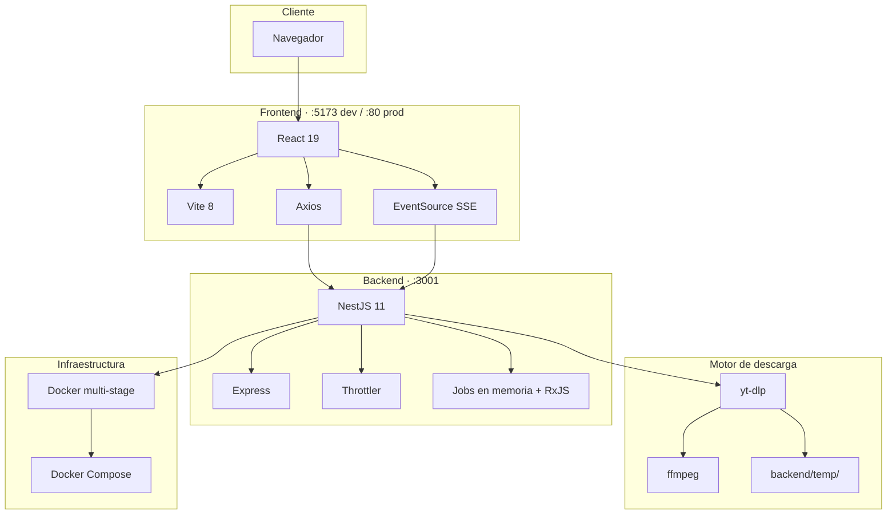

# Stack tecnológico — Video Downloader

Documentación del stack de **video-downloader** (UI: **JownloaderGlobal**).

## Vista general



## Arquitectura

| Capa | Rol | Puerto (dev) |
|------|-----|----------------|
| **Presentación** | SPA React con Vite | `5173` |
| **API** | REST + SSE sobre NestJS | `3001` |
| **Procesamiento** | yt-dlp + ffmpeg (subprocess) | — |
| **Persistencia** | Sistema de archivos (`temp/`) | — |
| **Despliegue** | Docker / Docker Compose | `80` (frontend prod) |

Patrón: **monorepo** con frontend y backend separados, comunicación HTTP.

---

## Frontend

| Categoría | Tecnología | Versión |
|-----------|------------|---------|
| Runtime | Node.js (build) | 20+ |
| Framework UI | React | ^19.2 |
| Bundler / dev server | Vite | ^8.0 |
| Plugin React | @vitejs/plugin-react | ^6.0 |
| Lenguaje | TypeScript | ~6.0 |
| HTTP client | Axios | ^1.16 |
| Tiempo real | EventSource (SSE nativo) | — |
| Animaciones | Framer Motion | ^12.38 |
| Iconos | Lucide React, Heroicons | ^1.16 / ^2.2 |
| UI / feedback | Radix Progress, react-hot-toast | ^1.1 / ^2.6 |
| Estilos | Tailwind CSS + PostCSS + Autoprefixer | ^4.3 |
| Tema | Sistema propio (`src/ui/colors.ts`) + `darkMode: class` | — |
| Lint | ESLint + typescript-eslint | ^10 / ^8 |

### Estructura clave

```
frontend/src/
├── components/     # UrlInput, VideoPreview, FormatSelector, ProgressBar, …
├── hooks/          # useVideoInfo, useDownload
├── lib/api.ts      # Cliente Axios + SSE
├── types/video.ts
└── ui/colors.ts    # Tokens de tema light/dark
```

### Comunicación con el backend

- **REST:** `POST /download/info`, `POST /download/start`
- **SSE:** `GET /download/progress/:jobId`
- **Descarga:** `GET /download/file/:jobId` (enlace directo en el navegador)

Variable de entorno: `VITE_API_URL` (default: `http://localhost:3001/api`).

---

## Backend

| Categoría | Tecnología | Versión |
|-----------|------------|---------|
| Runtime | Node.js | 20 (Docker) |
| Framework | NestJS | ^11.0 |
| HTTP | @nestjs/platform-express | ^11.0 |
| Config | @nestjs/config | ^4.0 |
| Rate limiting | @nestjs/throttler | ^6.5 (10 req/min) |
| Validación | class-validator + class-transformer | ^0.15 / ^0.5 |
| Reactividad | RxJS (SSE, Subjects) | ^7.8 |
| IDs de job | uuid | ^14.0 |
| MIME / archivos | mime-types, fs, child_process | ^3.0 |
| Lenguaje | TypeScript | ^5.7 |
| Tests | Jest, Supertest | ^30 / ^7 |
| Lint / format | ESLint, Prettier | ^9 / ^3.4 |

### Módulos principales

```
backend/src/
├── download/
│   ├── download.controller.ts   # REST + SSE + stream de archivo
│   ├── download.service.ts      # Integración yt-dlp
│   └── dto/                     # GetInfoDto, DownloadDto
├── common/utils/
│   └── platform-detector.ts
└── main.ts                      # CORS, ValidationPipe, prefix /api
```

### API

| Método | Ruta | Uso |
|--------|------|-----|
| `POST` | `/api/download/info` | Metadatos y formatos |
| `POST` | `/api/download/start` | Inicia job → `{ jobId }` |
| `GET` | `/api/download/progress/:jobId` | Progreso SSE |
| `GET` | `/api/download/file/:jobId` | Archivo final |

Variables de entorno: `PORT`, `FRONTEND_URL`, `NODE_ENV`.

---

## Motor de descarga (sistema)

No es una dependencia npm: se invoca por **subprocess** en el host o contenedor.

| Herramienta | Función |
|-------------|---------|
| **yt-dlp** | Extracción de metadatos (`--dump-json`) y descarga por `formatId` |
| **ffmpeg** | Fusión de pistas video+audio (`--merge-output-format mp4`) |
| **Python 3** | Runtime para instalar yt-dlp en Docker |

Formatos soportados en lógica de negocio: IDs de yt-dlp, `best`, `mp3` (extracción de audio).

Almacenamiento temporal: `backend/temp/` con limpieza automática (~1 h y tras descarga).

---

## DevOps y entorno

| Categoría | Tecnología |
|-----------|------------|
| Contenedor base | `node:20-slim` |
| Build backend | Docker multi-stage (`deps` → `builder` → `runner`) |
| Orquestación | Docker Compose 3.9 |
| Healthcheck | `curl` → `/api/download/health` |
| Volúmenes | `./backend/temp:/app/temp` |

### Servicios Compose

| Servicio | Build | Puerto |
|----------|-------|--------|
| `backend` | `./backend/Dockerfile` | `3001` |
| `frontend` | `./frontend` (requiere Dockerfile) | `80` |

---

## Calidad y herramientas de desarrollo

| Área | Backend | Frontend |
|------|---------|----------|
| Linter | ESLint 9 + typescript-eslint | ESLint 10 + react-hooks |
| Formatter | Prettier | — |
| Unit tests | Jest | — |
| E2E | Jest + Supertest | — |
| Type check | `tsc` (Nest build) | `tsc -b` + Vite |

---

## Diagrama de dependencias (runtime)

```
┌─────────────────────────────────────────────────────────┐
│                     NAVEGADOR                           │
│  React ──axios──► NestJS API                            │
│  React ──SSE────► NestJS (progress)                     │
│  <a href> ──────► NestJS (file stream)                  │
└─────────────────────────────────────────────────────────┘
                          │
                          ▼
┌─────────────────────────────────────────────────────────┐
│                   NESTJS (Node 20)                      │
│  Controller → Service → spawn(yt-dlp)                   │
│  Map<jobId, Subject> para progreso en memoria           │
└─────────────────────────────────────────────────────────┘
                          │
                          ▼
┌─────────────────────────────────────────────────────────┐
│              yt-dlp + ffmpeg → backend/temp/            │
└─────────────────────────────────────────────────────────┘
```

---

## Resumen en una línea

**React 19 + Vite 8 + TypeScript** ↔ **NestJS 11 + Express + SSE** ↔ **yt-dlp + ffmpeg**, empaquetado con **Docker** y orquestado con **Docker Compose**.

---

## Badges (opcional para README)

```markdown


```
